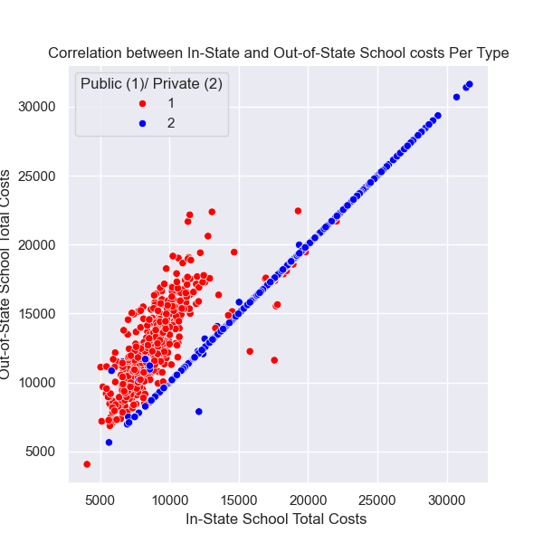
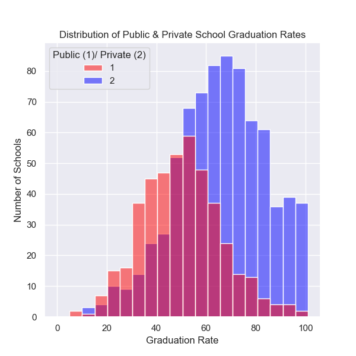

# **<u>Project: Higher Education Consulting Analytics by Ian Glish</u>**

## American Public vs. Private Colleges & Universities:  A Data Driven Analysis of Accessibility, Costs and Successfor Undergraduates - Providing Insights to Institutions of Higher Learning

#### This project aims to analyze a dataset of American college and university undergraduate programs to identify some meaningful data driven insights that could help a consulting service firm advise various colleges and universities. This analysis will benefit those various colleges and universities to help them make choices to benefit prospective and existing students get the most out of their higher learning experiences.

| Column Name | Description |
| ----------- | ----------- |
| College Name | College's Name |
| State | State college is located in |
| Public (1)/ Private(2) | Numeric indicator if a college is public or private |
| # appli. rec'd | Number of applications received by college |
| # appl. accepted | Number of applications accepted by students |
| # new stud. enrolled | Number of new students enrolled into particular college |
| % new stud. from top 10% | Percent of new students from top 10% of their graduating class |
| % new stud. from top 25% | Percent of new students from top 10% of their graduating class |
| # FT undergrad | Number of full time undergradute students enrolled |
| # PT undergrad | Number of part time undergradute students enrolled |
| in-state tuition | Cost of tuition for students in the same state as the college |
| out-of-state tuition | Cost of tuition for students not in the same state as the college |
| room | Room costs |
| board | Board costs |
| add. fees | Additional fees |
| estim. book costs | Estimated book costs |
| estim. personal $ | Estimated personal costs |
| % fac. w/PHD | Percent of faculty with a PhD |
| stud./fac. ratio | Student to faculty ratio |
| Graduation rate | Graduation rate
| instate_totalcosts | A combinaion of in-state tuition, room, board, additional fees, estimated book costs and estimated personal costs added together |
| outofstate_totalcosts | A combinaion of out-of-state tuition, room, board, additional fees, estimated book costs and estimated personal costs added together |
| outofstate_difference | The difference in out-of-state tuition costs from in-state tuition costs |
| percent accepted | Percent of applied students accepted by the college |
| percent enrolled | Percent of accepted students enrolled by the college |
| total undergrads | Total amount of full and part time undergraduate students |

#### The purpose of this project is to give American colleges & universities data based insights on key metrics: overall attendance costs & graduation rates & potential influential factors between public and private schools. Insights from this analysis can help in understanding the cost distribution relationship between public, private schools, in-state and out-of-state schools helping with competitive cost strategy. It also helps in understanding graduation rates between public and private schools and potential factors that could be influencing rates.
#### Data cleaning was once figuring out the shape of the dataset and identifying which data types each column were, I started by figuring out the number of missing values (NaN) per column and deciding if I wanted to drop any columns or rows, engineer any new features, fill in any of the missing values or change any data types. I decided to leave all the original columns, but determined which columns with numeric data types that I wanted to work with to then decided how to fill them in. I kept outliers in the dataset, and determined them to be either extremely high or low values or data entry issues. I didn't need to change any data types as each column was in the correct data type format for me to work with.
#### To get started on filling in the missing row values in the columns I wanted to work with, since they were numeric data types, I plotted each column individually using a boxplot to look for outliers. Since each of the columns I worked with had outliers, I decided to use the calculated median value, since the median is less influanced by outliers. 
#### Once the numeric columns were filled in, I decided to engineer 6 new features to help me get even more information to then make analysis from. 
#### Visulizations consisted of scatterplots, histograms, bar charts and boxplots to show relations, quantities and correlations between variables. Some visualization highlights from my analysis and presentation:

#### This visualization shows positive correlations between in-state school total costs and out-of-state school total cost for both public and private schools. The correlation for public school costs overall shows that in-state public school costs are less than out-of-state public school costs, shown by the left skewed, but medium height cluster of red dots. Private schools have a perfect positive correlation line of blue dots, showing as the price of in-state private school costs increases, it proportionally increases for out-of-state students as well.

#### This visualization shows that public and private schools had nearly identical ranges of graduation rates, with public school rates going a tiny bit lower. Public school graduation rates had a much more normal distribution than private's. Private school graduation rate had a more right skew to it, showing that overall graduation rates were higher rather than lower, with a peak graduation rate of 65-75%. Public school had a peak graduation rate of 55-60%.

### **Conclusions and recommendations**
#### Public schools had overall lower costs, a higher student-faculty ratio, less PhD holding faculty & lower peak graduation rate. On the other hand, private schools had overall higher costs, a higher student-faculty ratio, more advanced degree holding faculty & a higher peak graduation rate. From my analysis and the dataset provided to me, it shows that private schools have more factors that are helpful to attributing to a higher chance of graduation than public schools, assuming you are able to afford the higher costs and be able to have your application accepted.
#### For actionable insights, public schools could reduce the student-faculty ratio and increase the number of faculty with PhDs to help influance increased graduation rates. Public schools could also offer financial aid to help grow out-of-state interest. For private schools, increasing financial aid and scholarships to anyone that would qualify could help increase accessibility to students.
#### For next steps, I would want to correlate both total costs to graduation rates to look for any relationship and to try and collect data on how students are paying for school, whether it be a scholarship, financial aid, self funded by the student themselves or family, and seeing those various methods influance graduation rates.

